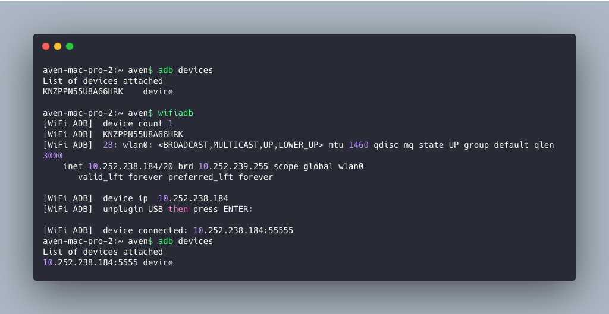
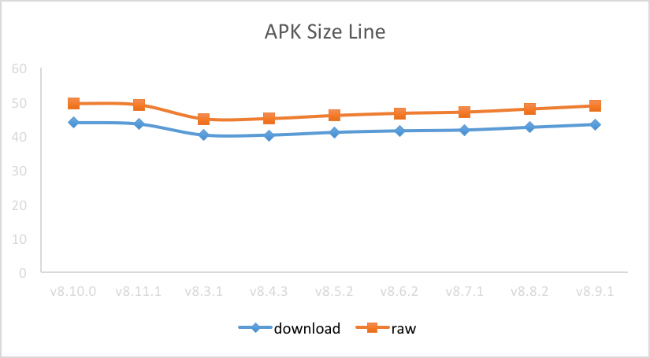
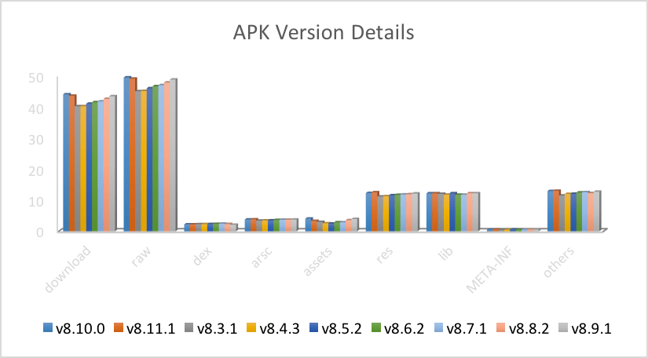
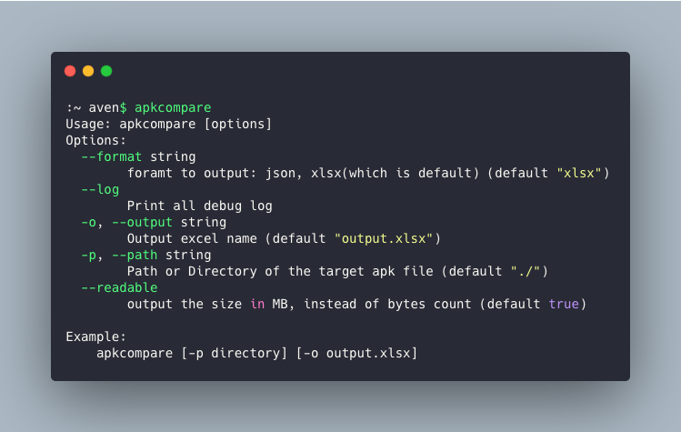

# homebrew-cli
Some cli tools that help to ease handy work, most of these are written in Golang.

We’ve shipped the tools with `Homebrew Formula` , so you can use brew to install.

## wifiadb
`wifiadb` is used to connect adb devices `wirelessly`.

### 1. Install cli

Make sure you have `homebrew` installed.

```bash
:~aven$ brew install wifiadb
```
### 2. How to use

1. Connect device to macOS, make sure both device and macOS are in the same network;
2. Use `wifiadb` to reconnect device, follow the cli prompt to unplugin the USB;

To make a preview, you can see that our device is connected as `10.252.238.184:5555` after running `wifiadb`.



## apkcompare

This tool is used to make comparison between apk files. It will generate a `xlsx` ouput, display the size difference.





### 1. Install cli

```bash
:~aven$ brew install apkcompare
```

### 2. How to use

Type `apkcompare` into terminal to find out the usage help.

Generally, it receives a folder of apks as input parameter (see as `-p, --path`), then generate a `xlsx` report.

```bash
apkcompare -p ./ -o report.xlsx
```

